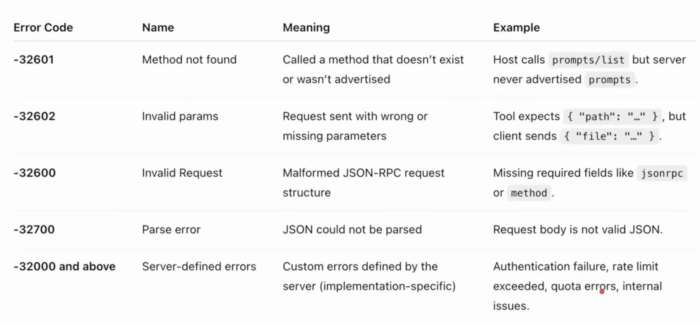

# Error Handling

## Definition
- Error handling in MCP is how the Host (client) and Server signal that something went wrong with a request
- MCP inherits JSON RPC's standard error object format

## Causes of Error

* Unsupported or mismatched protocol version.
* Internal server failure while processing a request.
* Calling a method for a capability that wasn't negotiated.
* Timeout exceeded → client cancels request.
* Invalid arguments to a tool
* Malformed JSON-RPC messages.

## Error Object Structure

* code → integer code that categorizes the error.
* message → short human-readable explanation.
* data → (optional) extra structured data for debugging or context.
        
        {
            "jsonrpc": "2.0",
            "id": 5,
            "error": {
                "code": -32601,
                "message": "Method not found",
                "data":, {
                    "extra": "optional info"
                }
            }
        }

## Error codes
