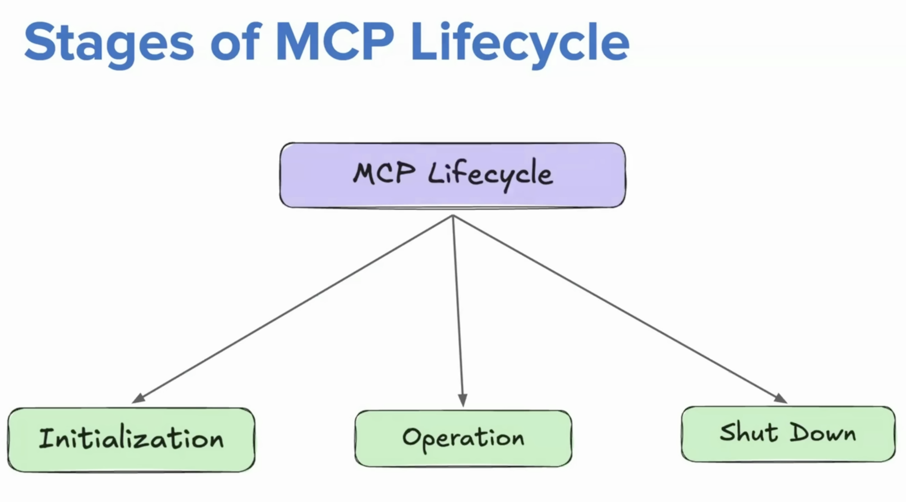

# MCP Lifecycle

1. Initialization:

    Step 1: Client sends initialize request containing.
    
            {
                "jsonrpc": "2.0",
                "id": 1,
                "method": "initialize",
                "params": {
                    "protocolVersion": "2025-03-26"
                    "capabilities": {
                        "roots": { 
                            "listChanged": true
                        }
                        "sampling": {}
                        "clientInfo": {
                            "name": "IDEPlugin",
                            "version": "1.0.0"
                    }
                }
            }
    
    Step 2: Server sends it's own capability info.

            {
                "jsonrpc": "2.0",
                "id": 1,
                "result": {
                    "protocolVersion": "2025-03-26",
                    "capabilities": {
                        "tools": {
                            "listChanged": true
                        },
                        "resources": {
                            "listChanged": true,
                            "subscribe": true
                        }
                    },
                    "serverInfo": {
                        "name": "FileSystemServer",
                        "version": "2.5.1"
                    },
                    "instructions": "Server is ready to accept commands"
                }
            }
        
    Step 3: After successful initialization, the client MUST send an initialized notification to indicate it is ready to begin normal operations:

            {
                "jsonrpc": "2.0",
                "method": "notifications/initialized"
            }

        Now the Client and Server are connected

    - Important Rules:

        - The client SHOULD NOT send requests other than pings before the server has responded to the initialize request.
        - The server SHOULD NOT send requests other than pings and logging before receiving the initialized notification.
    - Version Negotiation: Client checks if it can connect to the version of the server if that mismatches it disconnects.
    - Capability Negotiation:
        - Client and server capabilities establish which protocol features will be available during the session.
            - Client: roots, sampling, elicitation
            - Server: prompts, resources, tools, logging
            - Sub-capabilities: listChanged, subscribe
2. Operation
- The operation phase begins after initialization.
- During this phase, the client and server exchange JSON-RPC messages to perform tasks.

- Main Operations
    - Operation	-> Description
    - tools/list ->	Discover available tools
    - tools/call -> Execute a tool
    - resources/list -> Discover resources
    - resources/read -> Read resource content
    - prompts/list -> Discover prompts
    - prompts/get -> Retrieve a prompt
    - Notifications -> Send updates without expecting a response

### Important Operation Concepts

I. Requests and Responses

Requests have an ID.
Responses match the request ID.
Errors are returned using JSON-RPC error objects.

II. Notifications

One-way messages.
No response expected.
Example: notifications/tools/list_changed.

III. Capability-Based Operations

Clients should use features supported by the server.
Servers should respect client capabilities.

IV. Concurrent Operations

MCP uses JSON-RPC messages.
Multiple requests can be in flight, depending on the client and transport implementation.

3. Shut Down

The shutdown phase terminates the MCP connection and releases resources.

Shutdown may occur when:

    - The user closes the application.
    - The MCP client disconnects.
    - The server encounters a fatal error.
    - The transport connection is terminated.

MCP does not define a universal shutdown JSON-RPC lifecycle method in the current specification.

Instead, shutdown behavior depends on the transport and implementation.

For example:
* STDIO: Client may terminate the server process and close stdin/stdout.
* Streamable HTTP: Client may close or terminate its HTTP session as applicable.
* Custom transports: Follow their own connection lifecycle.

The server should clean up:

    - Active connections
    - Database connections
    - Background tasks
    - Temporary resources
    - External API sessions