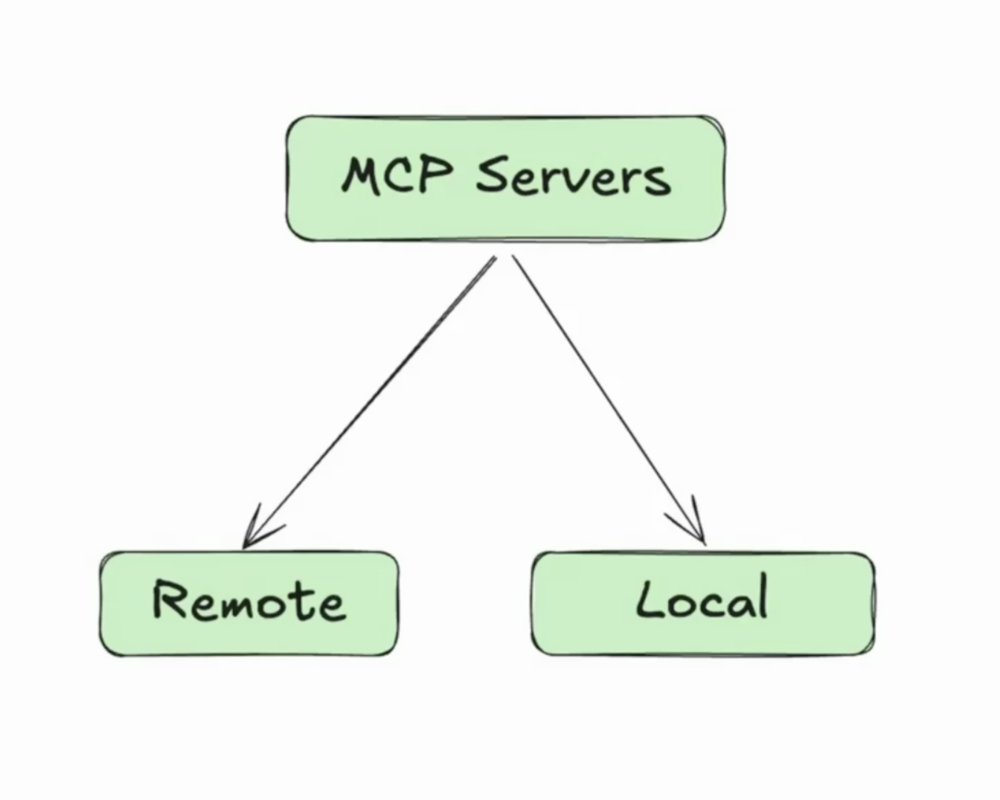
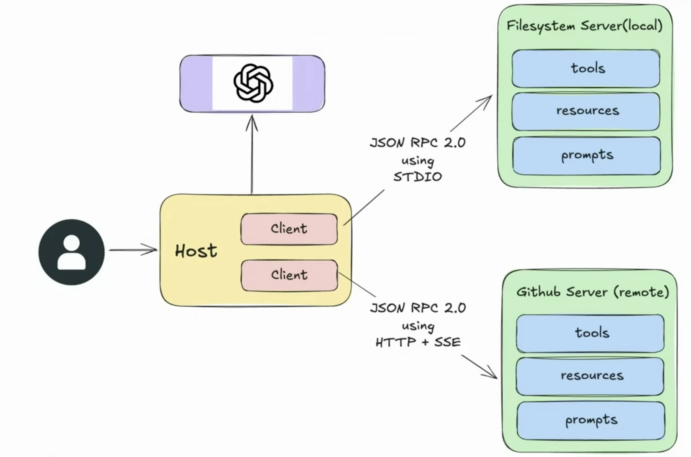

## Types of MCP Servers:

- A local server is a program running on your own computer. Uses STDIO as the Transport Layer.
- A remote server is a program running on another computer (somewhere else on the network or internet) that you connect to over a network. Uses HTTP/SSE as the Transport Layer.

## Transport Layer in MCP
MCP uses json rpc as data layer so that the communication is transport agnostic and we can use same json rpc over both transport layers:
- STDIO
- HTTP + SSE

## STDIO
STDIO refers to the built-in streams every program has.

stdin (input the program reads)
stout (output the program writes)

In MCP, these streams are used as transport layer between the client and server.

How Does it work?

- The host launches the server as a subprocess on the same machine.
- The host(client) writes JSON-RPC messages into the server's STDIN.
- The server reads those messages, processes them, and writes back responses to it's STDOUT.

What is benefit of the STDIO transport?
- Fast -> data is passed directly between processes.
- Secure -> no open network port that could be attacked; communication is only local.
- Simple -> every language/runtime supports reading/writing from stdin/stdout. No extra libraries required.

## HTTP + SSE
- Using HTTP allows the host to reach Servers running
anywhere
- Host sends JSON RPC requests using POST requests with a JSON payload
- The transport supports standard HTTP auth
methods(like API keys)

What is SSE?
- SSE stands for Server Sent Events, and it's an extension of HTTP.
- Using SSE the server sends multiple messages to client over a single open connection.
- Instead of sending one large JSON blob, the server can stream chunks of data as they are ready.
- Ideal for long running tasks or incremental updates.

## MCP Architecture
